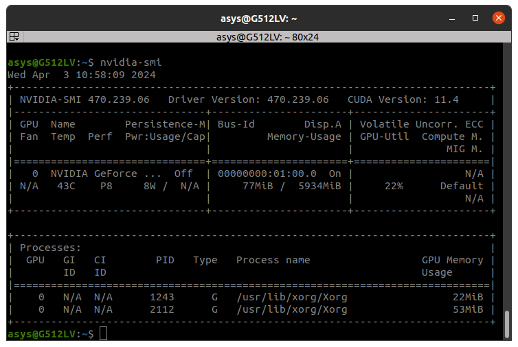
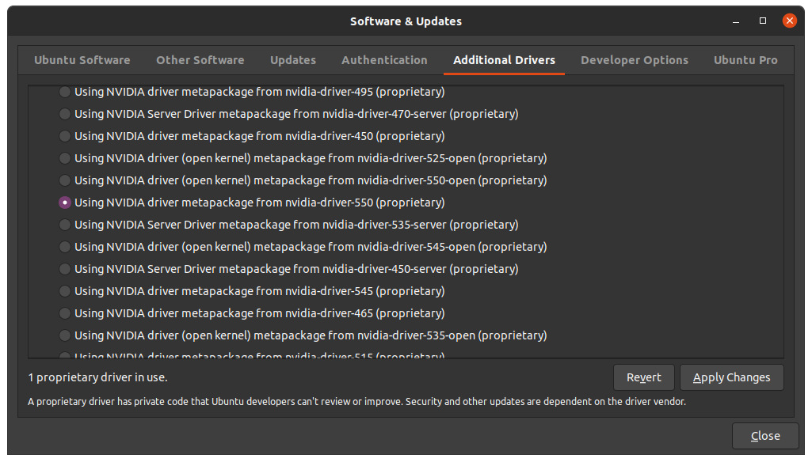

強烈建議以python venv來安裝  
以免跟其他專案的python pkg相衝突, e.g. ROS的pandas  
不同的環境也容易與ultralytics衝突  

# 專案中的檔案名稱
infer開頭的都是可以測試(預測, 偵測)  
train開頭的都是用來訓練model的  

# 準備環境 - nvidia
你需要nvidia的顯卡, 安裝nvidia driver(驅動)  
並視情況安裝CUDA(平行運算平台以及API)以及cuDNN(lib)  
但如果你只想使用pytorch, 或是你想用anaconda, 那麼CUDA或cuDNN可以先不用裝  

Windows版應該已經能夠自動更新nvidia driver  
Ubuntu版需要先用指令下載安裝特定版本的nvidia driver  
之後使用`nvidia-smi`可看到對應的版本, e.g.  
  
注意這個畫面並不代表你已經安裝了CUDA, 你必須用`nvcc --version`來看看是否已安裝CUDA以及其版本, 例如  
```bash
PS C:\ws\ultralytics_work> nvcc --version
nvcc: NVIDIA (R) Cuda compiler driver
Copyright (c) 2005-2024 NVIDIA Corporation
Built on Tue_Feb_27_16:28:36_Pacific_Standard_Time_2024
Cuda compilation tools, release 12.4, V12.4.99
Build cuda_12.4.r12.4/compiler.33961263_0
```
上面nvcc跟你說你現在有12.4, 才算是真的有  

## 關於CUDA
<details>
<summary>========================== 其他版本的安裝紀錄, 純參考可跳過 ==========================</summary>
[2024.4.3] 紀錄, 主要是driver 470->550的步驟, 可跳過  <br>
google看看有沒有較新的安裝方式, 畢竟網路上兩年前的安裝方式已經不能用了, 且ppa(Personal Package Archives)容易加入錯誤的路徑, 導致apt update都會出現ERR (例如NO_PUBKEY A4B469963BF863CC)  <br>
即便是官網的network安裝方式, 似乎也沒有針對舊的CUDA版本做路徑更新, 例如key的版本  <br>
注意不要安裝這個版本  <br>

~~`sudo apt install nvidia-cuda-toolkit`~~

因為這個版本只有CUDA 10.1版, 如下  
```
nvcc: NVIDIA (R) Cuda compiler driver
Copyright (c) 2005-2019 NVIDIA Corporation
Built on Sun_Jul_28_19:07:16_PDT_2019
Cuda compilation tools, release 10.1, V10.1.243
```

以下是直接用指令安裝local版, 似乎是可使用的  
```
wget https://developer.download.nvidia.com/compute/cuda/repos/ubuntu2004/x86_64/cuda-ubuntu2004.pin
sudo mv cuda-ubuntu2004.pin /etc/apt/preferences.d/cuda-repository-pin-600
wget https://developer.download.nvidia.com/compute/cuda/11.4.4/local_installers/cuda-repo-ubuntu2004-11-4-local_11.4.4-470.82.01-1_amd64.deb
sudo dpkg -i cuda-repo-ubuntu2004-11-4-local_11.4.4-470.82.01-1_amd64.deb
sudo apt-key add /var/cuda-repo-ubuntu2004-11-4-local/7fa2af80.pub
sudo apt-get update
sudo apt-get -y install cuda
```
但我的ubuntu在apt install安裝時秀出了需要更高級的CUDA版本, 所以只好裝更新的CUDA  
```
The following packages have unmet dependencies:
 cuda : Depends: cuda-12-4 (>= 12.4.0) but it is not going to be installed
E: Unable to correct problems, you have held broken packages.
```

以下是ubuntu 20.04安裝CUDA 12.4版  
```
wget https://developer.download.nvidia.com/compute/cuda/repos/ubuntu2004/x86_64/cuda-ubuntu2004.pin
sudo mv cuda-ubuntu2004.pin /etc/apt/preferences.d/cuda-repository-pin-600
wget https://developer.download.nvidia.com/compute/cuda/12.4.0/local_installers/cuda-repo-ubuntu2004-12-4-local_12.4.0-550.54.14-1_amd64.deb
sudo dpkg -i cuda-repo-ubuntu2004-12-4-local_12.4.0-550.54.14-1_amd64.deb
sudo cp /var/cuda-repo-ubuntu2004-12-4-local/cuda-*-keyring.gpg /usr/share/keyrings/
sudo apt-get update
sudo apt-get -y install cuda-toolkit-12-4
```
但系統感覺怪怪的<br>
只好直接升級nvidia driver 470->550  
```
sudo ubuntu-drivers list
sudo ubuntu-drivers install nvidia:525
```
指令無法安裝, 只好用Software & Updates來裝  
  

然後搭配上述的CUDA 12.4  <br>
但Path沒有幫忙設定, 所以自行加上  <br>
```
export PATH="/usr/local/cuda-12.4/bin:$PATH"
export LD_LIBRARY_PATH="/usr/local/cuda-12.4/lib64:$LD_LIBRARY_PATH"
sudo ln -s /usr/local/cuda /usr/local/cuda-12.4
```
建議加在bashrc, 開terminal都會自動加上  <br>

之後你鍵入`nvcc --version`應該會出現如下面的訊息  <br>
```
nvcc: NVIDIA (R) Cuda compiler driver
Copyright (c) 2005-2024 NVIDIA Corporation
Built on Tue_Feb_27_16:19:38_PST_2024
Cuda compilation tools, release 12.4, V12.4.99
Build cuda_12.4.r12.4/compiler.33961263_0
```
nvidia的軟體安裝本身就是一場災難  
==========================^其他版本的安裝紀錄==========================<br>
</details>

tl;dr  
在Ubuntu的Software & Updates直接安裝nvidia driver 550  
然後用nvidia官網的CUDA 12.4的local安裝方式  
```
wget https://developer.download.nvidia.com/compute/cuda/repos/ubuntu2004/x86_64/cuda-ubuntu2004.pin
sudo mv cuda-ubuntu2004.pin /etc/apt/preferences.d/cuda-repository-pin-600
wget https://developer.download.nvidia.com/compute/cuda/12.4.0/local_installers/cuda-repo-ubuntu2004-12-4-local_12.4.0-550.54.14-1_amd64.deb
sudo dpkg -i cuda-repo-ubuntu2004-12-4-local_12.4.0-550.54.14-1_amd64.deb
sudo cp /var/cuda-repo-ubuntu2004-12-4-local/cuda-*-keyring.gpg /usr/share/keyrings/
sudo apt-get update
sudo apt-get -y install cuda-toolkit-12-4
```
登錄Path到bashrc (注意CUDA版本)  
```
sudo ln -s /usr/local/cuda /usr/local/cuda-12.4
export PATH="/usr/local/cuda/bin:$PATH"
export LD_LIBRARY_PATH="/usr/local/cuda/lib64:$LD_LIBRARY_PATH"
```
鍵入`nvcc --version`應該會出現如下面的訊息  
```
nvcc: NVIDIA (R) Cuda compiler driver
Copyright (c) 2005-2024 NVIDIA Corporation
Built on Tue_Feb_27_16:19:38_PST_2024
Cuda compilation tools, release 12.4, V12.4.99
Build cuda_12.4.r12.4/compiler.33961263_0
```

## cuDNN
這個比較單純, 只要到官網登入帳號, 下載對應版本並放在相對資料夾即可, e.g.  
```
把 C:\Users<username>\Downloads\cuda\bin 資料夾內檔案複製到
C:\Program Files\NVIDIA GPU Computing Toolkit\CUDA\v12.0\bin

把 C:\Users<username>\Downloads\cuda\include 資料夾內檔案複製到
C:\Program Files\NVIDIA GPU Computing Toolkit\CUDA\v12.0\include

把 C:\Users<username>\Downloads\cuda\lib\x64 資料夾內檔案複製到
C:\Program Files\NVIDIA GPU Computing Toolkit\CUDA\v12.0\lib\x64
```
Ubuntu的建議用tar的方式, 因為deb檔案根本就不知道裝到哪裡去  
使用方式同windows, 將上述的資料夾複製到對應的資料夾  

# 準備訓練影像資料
## RoboFlow
可自動畫框, 影像argument, 雲端訓練等等  
官網註冊就能使用  
免費版的credit很少, 自動畫框跟推測只有1000/month, 雲端訓練只有3/month   
但付費版的自動畫框跟推測也只有10000/month, 訓練10/month  
如果要再加購的話, 一個框約0.75~0.9台幣[2024.4.10當下]  

## RoboFlow - Export
從RoboFlow下載訓練資料圖片跟標記檔, 通常就能夠直接拿來訓練  
但要注意的是, 有的dataset的設定檔 data.yaml會多一個path  
導致訓練時被引導到錯誤的路徑, 因此必須把路徑註解掉, 例如將  
`path: ../datasets/roboflow`  
變為  
`# path: ../datasets/roboflow`  
這樣, 訓練者如ultralytics就會去抓相對路徑而不被誤導

# 安裝lib
## 好用的yaml工具, 回存時可保留原本設定檔順序 以及註解
```
pip install ruamel.yaml
```
注意bool中的True/False會變成小寫, 但不影響ruamel.yaml的使用

# ultralytics
可用yolo v3 ~ v11 [2024.12.24當下]  
有torch, 就要先裝gpu版本, 以免ultralytics因相依直接裝cpu版本的  
下面的torch是配合CUDA12.4版的  
強烈建議到 `https://pytorch.org/get-started/locally/` 選擇要下載安裝的方式, **因為指令都會變**  
注意新的ultralytics版本才能使用新的yolo版, 例如2024.5 yolov10才推出, 就要下載更之後的 ultralytics  
```
pip install --pre torch torchvision torchaudio --index-url https://download.pytorch.org/whl/nightly/cu124
pip install ultralytics
pip install shapely  # 用來計算line, polygon等幾何運算
```

## tkinter (GUI)
有些module可能會用到GUI, 但有時python版本沒有包含, 得自行安裝
```
sudo apt-get install python3.10-tk
```
注意如果只指定`python3-tk`, 則可能會安裝到預設的python版 (例如ubuntu 20.04就會裝到python3.8)

如果venv連不到tkinter的路徑, 假設使用的是python3.10, 則
```
cd ~/.virtualenvs/cv/lib/python3.10/
```
再把tkinter連起來
```
ln -s /usr/lib/python3.10/tkinter tkinter
```
但就是建議不要再用這個GUI了, 不如用PyQt  

## ultralytics - 設定
有時候訓練過後, 搬移或改名datasets路徑會導致設定檔的路徑不同步, 導致無法訓練  
這時可到  
`/home/${USER}/.config/Ultralytics/settings.yaml`  
或是  
`C:\Users\[USER_ID]\AppData\Roaming\Ultralytics`  
然後將內容的`datasets_dir`, 指定到特定資料夾路徑, 建議直接使用絕對路徑  
幸運的是win版的路徑用斜線`/`也是可行的, 不然python容易把`\`視為跳脫符號

## ultralytics - 多線程運作錯誤
比較奇妙的情形, 當簡單的訓練語法的main沒有加上 `if __name__ == "__main__":`(if-clause protection)  
就會導致以下錯誤  
```
An attempt has been made to start a new process before the
current process has finished its bootstrapping phase.
```
看了一下console居然跑了兩個net, 很神奇的是加了if-clause protection之後, 就不會再出現錯誤  
但有些電腦似乎沒有這種限制, 目前是在RTX2070 SUPER有看到  

## ultralytics - 訓練硬體規格需求
你可以選其中一種size的model: [yolov8n, yolov8s, yolov8m, yolov8l, yolov8x]  
RTX2060-6GB only can use yolov8n and yolov8s with batch=16, but yolov8m with batch=8  
看起來在batch=8時:  
 - yolov8m, 會用掉4GB左右的記憶體    
 - yolov8l, 會用掉5.6GB左右的記憶體  

batch=16時:  
 - yolov8x會用掉13.3GB  

可作為硬體規格以及需求參考
