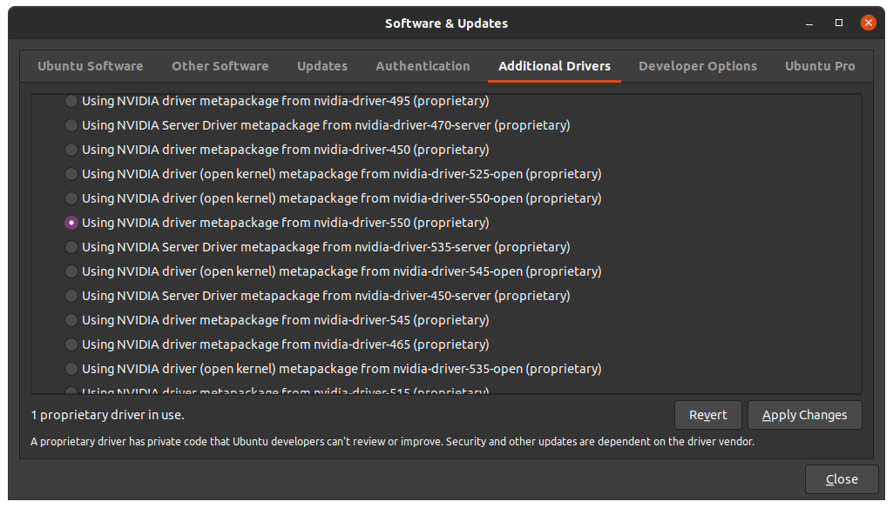

## 關於舊版本的CUDA
[2024.4.3] 紀錄, 主要是driver 470->550的步驟, 可跳過  
google看看有沒有較新的安裝方式, 畢竟網路上兩年前的安裝方式已經不能用了, 且ppa(Personal Package Archives)容易加入錯誤的路徑, 導致apt update都會出現ERR (例如NO_PUBKEY A4B469963BF863CC)  
即便是官網的network安裝方式, 似乎也沒有針對舊的CUDA版本做路徑更新, 例如key的版本  
注意不要安裝這個版本  

~~`sudo apt install nvidia-cuda-toolkit`~~

因為這個版本只有CUDA 10.1版, 如下  
```
nvcc: NVIDIA (R) Cuda compiler driver
Copyright (c) 2005-2019 NVIDIA Corporation
Built on Sun_Jul_28_19:07:16_PDT_2019
Cuda compilation tools, release 10.1, V10.1.243
```

以下是直接用指令安裝local版, 似乎是可使用的  
```
wget https://developer.download.nvidia.com/compute/cuda/repos/ubuntu2004/x86_64/cuda-ubuntu2004.pin
sudo mv cuda-ubuntu2004.pin /etc/apt/preferences.d/cuda-repository-pin-600
wget https://developer.download.nvidia.com/compute/cuda/11.4.4/local_installers/cuda-repo-ubuntu2004-11-4-local_11.4.4-470.82.01-1_amd64.deb
sudo dpkg -i cuda-repo-ubuntu2004-11-4-local_11.4.4-470.82.01-1_amd64.deb
sudo apt-key add /var/cuda-repo-ubuntu2004-11-4-local/7fa2af80.pub
sudo apt-get update
sudo apt-get -y install cuda
```
但我的ubuntu在apt install安裝時秀出了需要更高級的CUDA版本, 所以只好裝更新的CUDA  
```
The following packages have unmet dependencies:
 cuda : Depends: cuda-12-4 (>= 12.4.0) but it is not going to be installed
E: Unable to correct problems, you have held broken packages.
```

以下是ubuntu 20.04安裝CUDA 12.4版  
```
wget https://developer.download.nvidia.com/compute/cuda/repos/ubuntu2004/x86_64/cuda-ubuntu2004.pin
sudo mv cuda-ubuntu2004.pin /etc/apt/preferences.d/cuda-repository-pin-600
wget https://developer.download.nvidia.com/compute/cuda/12.4.0/local_installers/cuda-repo-ubuntu2004-12-4-local_12.4.0-550.54.14-1_amd64.deb
sudo dpkg -i cuda-repo-ubuntu2004-12-4-local_12.4.0-550.54.14-1_amd64.deb
sudo cp /var/cuda-repo-ubuntu2004-12-4-local/cuda-*-keyring.gpg /usr/share/keyrings/
sudo apt-get update
sudo apt-get -y install cuda-toolkit-12-4
```
但系統感覺怪怪的  
只好直接升級nvidia driver 470->550  
```
sudo ubuntu-drivers list
sudo ubuntu-drivers install nvidia:525
```
指令無法安裝, 只好用Software & Updates來裝  
  

然後搭配上述的CUDA 12.4  
但Path沒有幫忙設定, 所以自行加上  
```
export PATH="/usr/local/cuda-12.4/bin:$PATH"
export LD_LIBRARY_PATH="/usr/local/cuda-12.4/lib64:$LD_LIBRARY_PATH"
sudo ln -s /usr/local/cuda /usr/local/cuda-12.4
```
建議加在bashrc, 開terminal都會自動加上  

使用`nvidia-smi`可看到對應的版本, e.g.  
```bash
> nvidia-smi
Wed Dec 25 22:08:15 2024
+-----------------------------------------------------------------------------------------+
| NVIDIA-SMI 551.86                 Driver Version: 551.86         CUDA Version: 12.4     |
|-----------------------------------------+------------------------+----------------------+
| GPU  Name                     TCC/WDDM  | Bus-Id          Disp.A | Volatile Uncorr. ECC |
| Fan  Temp   Perf          Pwr:Usage/Cap |           Memory-Usage | GPU-Util  Compute M. |
|                                         |                        |               MIG M. |
|=========================================+========================+======================|
|   0  NVIDIA GeForce RTX 4060 ...  WDDM  |   00000000:01:00.0 Off |                  N/A |
| N/A   41C    P8              3W /   60W |       0MiB /   8188MiB |      0%      Default |
|                                         |                        |                  N/A |
+-----------------------------------------+------------------------+----------------------+

+-----------------------------------------------------------------------------------------+
| Processes:                                                                              |
|  GPU   GI   CI        PID   Type   Process name                              GPU Memory |
|        ID   ID                                                               Usage      |
|=========================================================================================|
|  No running processes found                                                             |
+-----------------------------------------------------------------------------------------+
```
注意這個畫面並不代表你已經安裝了CUDA, 你必須用`nvcc --version`來看看是否已安裝CUDA以及其版本, 例如  
```bash
> nvcc --version
nvcc: NVIDIA (R) Cuda compiler driver
Copyright (c) 2005-2024 NVIDIA Corporation
Built on Tue_Feb_27_16:28:36_Pacific_Standard_Time_2024
Cuda compilation tools, release 12.4, V12.4.99
Build cuda_12.4.r12.4/compiler.33961263_0
```
上面nvcc跟你說你現在有12.4, 才算是真的有  

## cuDNN
這個比較單純, 只要到官網登入帳號, 下載對應版本並放在相對資料夾即可, e.g.  
```
把 C:\Users<username>\Downloads\cuda\bin 資料夾內檔案複製到
C:\Program Files\NVIDIA GPU Computing Toolkit\CUDA\v12.0\bin

把 C:\Users<username>\Downloads\cuda\include 資料夾內檔案複製到
C:\Program Files\NVIDIA GPU Computing Toolkit\CUDA\v12.0\include

把 C:\Users<username>\Downloads\cuda\lib\x64 資料夾內檔案複製到
C:\Program Files\NVIDIA GPU Computing Toolkit\CUDA\v12.0\lib\x64
```
Ubuntu的建議用tar的方式, 因為deb檔案根本就不知道裝到哪裡去  
使用方式同windows, 將上述的資料夾複製到對應的資料夾  
